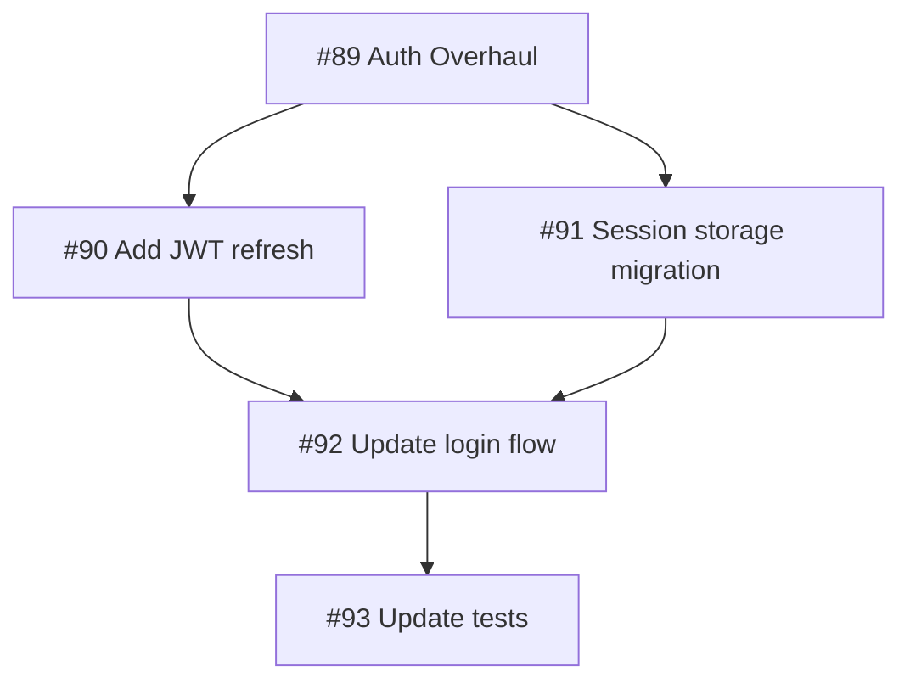

# Autonomous Agent Swarm Architecture

## Overview

A self-hosted (PoC) → cloud-deployed system of collaborating Claude agents that autonomously resolve GitHub issues and produce PRs, with human approval gates at plan and PR stages.

## Design Principles

- **Cost-first**: Route to cheapest capable model per task
- **GitHub-native visibility**: All status visible in GitHub UI without external dashboards
- **Monorepo-first, multi-repo-ready**: File-level coordination now, repo-level later
- **Markdown-preferred**: Human-readable plans and configs; JSON only when machine parsing is essential
- **Fail-forward**: Fixer agent attempts recovery before human escalation

---

## System Architecture

```
┌─────────────────────────────────────────────────────────────────────────────┐
│                              GitHub Organization                            │
│  ┌─────────────┐  ┌─────────────┐  ┌─────────────┐  ┌─────────────────────┐│
│  │   Issues    │  │  Webhooks   │  │   Checks    │  │  PR Comments/Labels ││
│  │ (trigger)   │  │  (events)   │  │  (status)   │  │   (approval/comms)  ││
│  └──────┬──────┘  └──────┬──────┘  └──────▲──────┘  └──────────▲──────────┘│
└─────────┼────────────────┼────────────────┼────────────────────┼───────────┘
          │                │                │                    │
          ▼                ▼                │                    │
┌─────────────────────────────────────────────────────────────────────────────┐
│                          Orchestrator Service                               │
│                                                                             │
│  ┌──────────────────┐  ┌──────────────────┐  ┌────────────────────────────┐│
│  │   GitHub App     │  │   Task Router    │  │     Coordination Layer     ││
│  │   (webhooks,     │  │   (issue→agent   │  │  • File locks (Redis)      ││
│  │    Checks API)   │  │    assignment)   │  │  • Branch management       ││
│  │                  │  │                  │  │  • Conflict detection      ││
│  └────────┬─────────┘  └────────┬─────────┘  └────────────┬───────────────┘│
│           │                     │                         │                 │
│  ┌────────▼─────────────────────▼─────────────────────────▼───────────────┐│
│  │                         Task State Machine                             ││
│  │  QUEUED → PLANNING → PLAN_REVIEW → APPROVED → EXECUTING → PR_OPEN     ││
│  │     │         │           │                        │          │        ││
│  │     └─────────┴───────────┴────────────────────────┴──────────┘        ││
│  │                            ↓ (on failure)                              ││
│  │                      FIXER_REVIEW → HUMAN_ESCALATION                   ││
│  └────────────────────────────────────────────────────────────────────────┘│
└─────────────────────────────────────────────────────────────────────────────┘
          │
          ▼
┌─────────────────────────────────────────────────────────────────────────────┐
│                            Agent Pool                                       │
│                                                                             │
│  ┌─────────────────┐  ┌─────────────────┐  ┌─────────────────┐            │
│  │  Worker Agent   │  │  Worker Agent   │  │  Fixer Agent    │            │
│  │  (issue→PR)     │  │  (issue→PR)     │  │  (review fails) │            │
│  │                 │  │                 │  │                 │            │
│  │ ┌─────────────┐ │  │ ┌─────────────┐ │  │ ┌─────────────┐ │            │
│  │ │ OpenHands   │ │  │ │ OpenHands   │ │  │ │ OpenHands   │ │            │
│  │ │ Runtime     │ │  │ │ Runtime     │ │  │ │ Runtime     │ │            │
│  │ ├─────────────┤ │  │ ├─────────────┤ │  │ ├─────────────┤ │            │
│  │ │ Git Worktree│ │  │ │ Git Worktree│ │  │ │ Git Worktree│ │            │
│  │ │ (isolated)  │ │  │ │ (isolated)  │ │  │ │ (isolated)  │ │            │
│  │ └─────────────┘ │  │ └─────────────┘ │  │ └─────────────┘ │            │
│  └─────────────────┘  └─────────────────┘  └─────────────────┘            │
│                                                                             │
│  ┌─────────────────┐  ┌─────────────────┐                                  │
│  │  CI Agent       │  │  Planner Agent  │  (specialized roles, optional)  │
│  │  (can trigger   │  │  (architecture  │                                  │
│  │   workflows)    │  │   decisions)    │                                  │
│  └─────────────────┘  └─────────────────┘                                  │
└─────────────────────────────────────────────────────────────────────────────┘
```

---

## GitHub-Native Visibility

All agent activity surfaces in GitHub's existing UI—no external dashboard required for PoC.

### Checks API Integration

The GitHub App creates Check Runs for each task phase:

```
Issue #42: "Fix login timeout bug"

Checks tab shows:
┌────────────────────────────────────────────────────────────────┐
│ ✓ Agent Planning         2m 15s    "Plan ready for review"    │
│ ◐ Agent Execution        running   "Modifying auth/jwt.ts"    │
│ ○ Agent Tests            queued                               │
└────────────────────────────────────────────────────────────────┘
```

Check Run features used:
- **Status**: `queued` → `in_progress` → `completed`
- **Conclusion**: `success`, `failure`, `action_required`
- **Output summary**: Markdown with plan details, files touched, reasoning
- **Annotations**: Inline code comments on specific lines (for issues found)
- **Details URL**: Links to full agent logs (if external logging desired)

### Labels for State

```
agent:planning        - Agent is analyzing issue
agent:awaiting-plan   - Plan posted, needs human /approve
agent:executing       - Approved, agent implementing
agent:pr-open         - PR created, standard review
agent:pr-reviewing    - Agent reviewing PR (human requested)
agent:pr-fixing       - Agent addressing review comments
agent:blocked         - Waiting on another task (file conflict)
agent:failed          - Fixer couldn't resolve, human needed
agent:completed       - Archived, PR merged
agent:abandoned       - Archived, closed without merge
```

### Comment-Based Interaction

**Command Reference:**

| Command | Context | Effect |
|---------|---------|--------|
| `/approve` | Plan comment | Approve plan, begin implementation |
| `/agent-review` | Open PR | Request agent code review |
| `/agent-fix` | PR with review comments | Agent addresses review feedback |
| `/agent-plan` | Issue | Request Planner agent analysis |
| `/approve-plan` | Planner output | Approve dependency plan, create sub-issues |
| `/agent-stop` | Any | Halt current agent work, preserve state |

**Plan Approval Flow:**
```markdown
<!-- Posted by agent -->
## 🤖 Agent Plan for #42

**Summary**: JWT tokens expire early due to clock skew between services.

**Approach**:
1. Add 30-second grace period to token validation in `auth/jwt.ts`
2. Add clock skew logging in `auth/middleware.ts`
3. Add unit test for grace period behavior

**Files to modify**:
- `src/auth/jwt.ts` (15 lines)
- `src/auth/middleware.ts` (8 lines)
- `tests/auth/jwt.test.ts` (new file, ~40 lines)

**Estimated cost**: ~$0.12 (Haiku for implementation)

---
Reply `/approve` to proceed, or provide feedback.
```

**Human approves:**
```
/approve
```

**Or requests changes:**
```
Don't add logging to middleware, just fix the validation.
```

Agent revises plan and resubmits.

### Commit Status for Quick Glance

Lightweight status on the branch/commit level:
```
agent-42-fix-login ● Agent: executing (3/5 files)
```

---

## Coordination Layer

### File-Level Locking (Monorepo)

Prevents merge conflicts when multiple agents work simultaneously.

```python
# Redis-based soft locks
class FileCoordinator:
    async def analyze_scope(self, issue: Issue) -> Set[str]:
        """LLM call to predict files that will be touched"""
        prompt = f"""
        Given this issue, list the files likely to be modified.
        Issue: {issue.title}
        {issue.body}
        
        Respond with file paths, one per line.
        """
        response = await llm.complete(prompt, model="haiku")
        return set(response.strip().split("\n"))
    
    async def acquire_locks(self, task_id: str, files: Set[str], ttl: int = 1800):
        """Acquire locks or return conflicting task"""
        for file in files:
            existing = await redis.get(f"lock:{file}")
            if existing and existing != task_id:
                return {"conflict": existing, "file": file}
        
        # Atomic acquisition
        pipe = redis.pipeline()
        for file in files:
            pipe.setex(f"lock:{file}", ttl, task_id)
        await pipe.execute()
        return {"acquired": True}
    
    async def release_locks(self, task_id: str):
        """Release all locks held by task"""
        keys = await redis.keys(f"lock:*")
        for key in keys:
            if await redis.get(key) == task_id:
                await redis.delete(key)
```

### Branch Strategy

```
main
├── agent/42-fix-login-timeout      # Worker agent branch
├── agent/43-add-rate-limiting      # Another worker
├── agent/44-refactor-auth          # Blocked (conflicts with 42)
└── agent/fixer/42-retry-1          # Fixer agent attempt
```

Each agent gets isolated worktree:
```bash
# Orchestrator spawns agent with dedicated worktree
git worktree add /workspaces/agent-42 -b agent/42-fix-login-timeout
```

### Conflict Detection

Before assigning task:
```python
async def can_assign(issue: Issue) -> AssignmentResult:
    predicted_files = await coordinator.analyze_scope(issue)
    
    # Check for locks
    for file in predicted_files:
        lock = await redis.get(f"lock:{file}")
        if lock:
            return AssignmentResult(
                assignable=False,
                reason=f"File {file} locked by task {lock}",
                action="queue"  # or "partition" for large issues
            )
    
    # Check for in-flight PRs touching same files
    open_prs = await github.get_open_agent_prs()
    for pr in open_prs:
        pr_files = set(pr.changed_files)
        overlap = predicted_files & pr_files
        if overlap:
            return AssignmentResult(
                assignable=False,
                reason=f"PR #{pr.number} modifying {overlap}",
                action="wait_for_merge"
            )
    
    return AssignmentResult(assignable=True)
```

---

## Task Lifecycle

### State Machine

```
┌─────────┐    ┌─────────┐    ┌────────────┐    ┌──────────┐
│ QUEUED  │───▶│PLANNING │───▶│PLAN_REVIEW │───▶│ APPROVED │
└─────────┘    └────┬────┘    └─────┬──────┘    └────┬─────┘
                    │               │                 │
                    │◀──────────────┘                 │
                    │         (revision)              ▼
                    │                           ┌──────────┐
                    │                           │EXECUTING │
                    │                           └────┬─────┘
                    │                                │
                    │                    ┌───────────┼───────────┐
                    │                    │           │           │
                    │                    ▼           ▼           ▼
                    │               ┌────────┐  ┌────────┐  ┌────────┐
                    │               │PR_OPEN │  │ FAILED │  │SUCCESS │
                    │               └───┬────┘  └───┬────┘  └───┬────┘
                    │                   │           │           │
                    │     ┌─────────────┼───────────┘           │
                    │     │             │                       │
                    │     │    ┌────────┴────────┐              │
                    │     │    │                 │              │
                    │     │    ▼                 ▼              │
                    │     │ ┌──────────┐  ┌───────────┐         │
                    │     │ │PR_REVIEW │  │ PR_FIX    │         │
                    │     │ │ (agent)  │  │ (agent)   │         │
                    │     │ └────┬─────┘  └─────┬─────┘         │
                    │     │      │              │               │
                    │     │      └──────┬───────┘               │
                    │     │             │                       │
                    │     ▼             ▼                       │
                    │ ┌────────────┐ ┌─────────┐                │
                    │ │FIXER_REVIEW│ │(back to │                │
                    │ └─────┬──────┘ │ PR_OPEN)│                │
                    │       │        └─────────┘                │
                    │ ┌─────┴─────┐                             │
                    │ │           │                             │
                    │ ▼           ▼                             │
                    │┌─────┐ ┌───────────┐                      │
                    ││RETRY│ │HUMAN_ESCAL│                      │
                    │└──┬──┘ └───────────┘                      │
                    │   │                                       │
                    └───┘                                       │
                                                                │
                    ┌───────────────────────────────────────────┘
                    │
                    ▼
             ┌────────────┐
             │  ARCHIVED  │◀── (PR merged OR issue closed)
             │ (with log) │
             └────────────┘
```

### State Transitions

| From | To | Trigger | GitHub Action |
|------|-----|---------|---------------|
| QUEUED | PLANNING | Agent available, no file conflicts | Create Check Run (in_progress) |
| PLANNING | PLAN_REVIEW | Plan generated | Post plan comment, add label |
| PLAN_REVIEW | APPROVED | Human `/approve` comment | Update Check Run |
| PLAN_REVIEW | PLANNING | Human feedback | Agent revises plan |
| APPROVED | EXECUTING | Immediate | Update Check Run status |
| EXECUTING | PR_OPEN | Implementation complete | Create PR, Check Run (success) |
| EXECUTING | FAILED | Tests fail, timeout, error | Check Run (failure) |
| PR_OPEN | PR_AGENT_REVIEW | Human `/agent-review` | Assign reviewer agent |
| PR_OPEN | PR_AGENT_FIX | Human `/agent-fix` | Assign fixer agent to PR |
| PR_AGENT_REVIEW | PR_OPEN | Review posted | Agent posts review comments |
| PR_AGENT_FIX | PR_OPEN | Fixes pushed | Agent commits, notifies human |
| PR_OPEN | COMPLETED | PR merged | Archive task with decision log |
| PR_OPEN | ARCHIVED | PR/issue closed | Archive with "abandoned" status |
| FAILED | FIXER_REVIEW | Automatic | Assign to fixer agent |
| FIXER_REVIEW | RETRY | Fixer succeeds | Back to EXECUTING |
| FIXER_REVIEW | HUMAN_ESCAL | Fixer fails | Add `agent:failed` label, notify |

---

## Agent Roles & Model Routing

### Cost-Optimized Model Selection

```python
MODEL_ROUTING = {
    "file_analysis": "claude-haiku-4-5-20251001",      # $0.25/MTok in
    "planning": "claude-haiku-4-5-20251001",           # Simple plans
    "planning_complex": "claude-sonnet-4-5-20250929", # Multi-component
    "implementation": "claude-sonnet-4-5-20250929",   # Default
    "implementation_trivial": "claude-haiku-4-5-20251001",  # One-liners
    "fixer": "claude-sonnet-4-5-20250929",            # Needs reasoning
    "architecture": "claude-opus-4-5-20251101",       # Rare, complex
}

def select_model(task_type: str, complexity: str) -> str:
    if complexity == "trivial":
        return MODEL_ROUTING.get(f"{task_type}_trivial", MODEL_ROUTING[task_type])
    if complexity == "complex":
        return MODEL_ROUTING.get(f"{task_type}_complex", MODEL_ROUTING[task_type])
    return MODEL_ROUTING[task_type]
```

### Complexity Estimation

```python
async def estimate_complexity(issue: Issue) -> str:
    """Quick Haiku call to classify complexity"""
    response = await llm.complete(
        model="claude-haiku-4-5-20251001",
        prompt=f"""
        Classify this issue's implementation complexity.
        
        Issue: {issue.title}
        {issue.body}
        
        Respond with exactly one word: trivial, standard, or complex
        
        trivial: single file, <20 lines, obvious fix
        standard: 2-5 files, clear approach
        complex: architectural changes, multiple components, ambiguous requirements
        """
    )
    return response.strip().lower()
```

### Agent Types

**Worker Agent** (most common):
- Handles issue → PR flow
- Uses Haiku for planning, Sonnet for implementation
- Isolated worktree per task

**Fixer Agent**:
- Reviews failed tasks
- Attempts automated fixes (test failures, lint errors)
- Escalates with diagnosis if unfixable
- Always uses Sonnet (needs reasoning about failures)

**PR Review Agent** (human-gated):
- Only activated when human requests via `/agent-review`
- Reviews code for: test coverage, style consistency, potential bugs
- Posts review comments, never approves/merges autonomously
- Human remains final decision maker

```markdown
<!-- Human triggers review -->
/agent-review focus on error handling and edge cases

<!-- Agent posts review -->
## 🤖 Agent Code Review

**Files reviewed**: 3

### src/auth/jwt.ts

**Line 42-45**: Consider handling the case where `token` is undefined.
The current implementation will throw a cryptic error.

```suggestion
if (!token) {
  throw new AuthError('Token is required');
}
```

**Line 78**: Magic number `30` should be a named constant.

### tests/auth/jwt.test.ts

✓ Good coverage of happy path
⚠️ Missing test for expired token with grace period boundary

---
*Review complete. Approve/request changes as you see fit.*
```

**PR Fix Agent** (human-gated):
- Activated via `/agent-fix` after review comments exist
- Addresses specific review feedback
- Pushes additional commits to existing PR branch
- Reports what was fixed vs. needs human decision

```markdown
<!-- Human triggers fix -->
/agent-fix address the error handling and magic number comments

<!-- Agent responds -->
## 🤖 Agent Fix Applied

**Addressed**:
- ✅ Added null check for token (line 42-45)
- ✅ Extracted `GRACE_PERIOD_SECONDS = 30` constant

**Needs human decision**:
- ⚠️ The boundary test case—unclear if grace period should be inclusive or exclusive

Pushed commit `a]1b2c3d`: "fix: address review feedback on error handling"
```

**Planner Agent** (PM role):
- Opus-powered for architectural decisions and dependency analysis
- Activated for: large issues, epics, or explicit `/agent-plan` request
- Identifies dependencies between issues
- Can split large issues into subtasks with ordering
- Documents technical approach before any implementation

```markdown
<!-- Planner agent output for large feature -->
## 🤖 Implementation Plan: User Authentication Overhaul (#89)

### Dependency Analysis



### Recommended Execution Order

| Phase | Issue | Blocks | Can Parallelize |
|-------|-------|--------|-----------------|
| 1 | #90 JWT refresh | #92 | Yes |
| 1 | #91 Session migration | #92 | Yes (with #90) |
| 2 | #92 Login flow | #93 | No |
| 3 | #93 Test updates | — | No |

### Risk Assessment

- **High**: Session migration (#91) touches production data
  - *Recommendation*: Human review migration script before execution
- **Medium**: JWT refresh (#90) changes token format
  - *Recommendation*: Feature flag for rollback

### Estimated Effort

| Issue | Complexity | Est. Agent Time | Est. Cost |
|-------|------------|-----------------|-----------|
| #90 | Standard | 15 min | $0.25 |
| #91 | Complex | 30 min | $0.50 |
| #92 | Standard | 20 min | $0.30 |
| #93 | Trivial | 5 min | $0.05 |
| **Total** | | **70 min** | **$1.10** |

---
Reply `/approve-plan` to create sub-issues and begin execution, 
or provide feedback for revision.
```

**CI Agent** (optional, specialized):
- Can trigger GitHub Actions workflows
- Monitors CI results
- Used when task requires running integration tests before PR

---

## Decision Records & Archival

### Decision Log

Every human decision is recorded for audit and learning:

```yaml
# Stored per-task in Redis/PostgreSQL
task_id: "issue-42"
decisions:
  - timestamp: "2025-01-10T14:32:00Z"
    type: "plan_feedback"
    human: "@eduser"
    action: "revision_requested"
    comment: "Don't add logging to middleware, just fix validation"
    
  - timestamp: "2025-01-10T15:01:00Z"
    type: "plan_approval"
    human: "@eduser"
    action: "approved"
    plan_version: 2
    
  - timestamp: "2025-01-10T16:45:00Z"
    type: "pr_review_delegation"
    human: "@eduser"
    action: "agent_review_requested"
    comment: "/agent-review focus on test coverage"
    
  - timestamp: "2025-01-10T17:20:00Z"
    type: "pr_fix_delegation"
    human: "@eduser"
    action: "agent_fix_requested"
    comment: "/agent-fix address review comments"
```

### Archive on Completion

When PR merges or issue closes:

```python
async def archive_task(task: Task):
    """Archive completed task with full history"""
    archive_record = {
        "task_id": task.id,
        "issue_number": task.issue.number,
        "outcome": task.outcome,  # merged, closed, abandoned
        "timeline": {
            "created": task.created_at,
            "first_plan": task.first_plan_at,
            "approved": task.approved_at,
            "pr_opened": task.pr_opened_at,
            "completed": task.completed_at,
        },
        "decisions": task.decision_log,
        "plans": task.plan_versions,  # All iterations
        "agents_involved": task.agent_ids,
        "model_usage": task.token_usage,  # Cost tracking
        "files_changed": task.files_changed,
    }
    
    # Store in archives table (queryable for patterns)
    await db.archives.insert(archive_record)
    
    # Post summary to issue
    await github.post_comment(
        task.issue,
        format_completion_summary(archive_record)
    )
    
    # Clean up working state
    await redis.delete(f"task:{task.id}:*")
    await cleanup_worktree(task.branch)
```

### Completion Summary Comment

```markdown
## 🤖 Agent Task Completed

**Outcome**: Merged via PR #87

**Timeline**:
| Phase | Duration |
|-------|----------|
| Planning | 12 min (2 revisions) |
| Human review | 45 min |
| Implementation | 8 min |
| PR review | 1h 20min |
| **Total** | **2h 25min** |

**Agents Used**: worker-agent-3, reviewer-agent-1, fixer-agent-2

**Decisions Made**: 4 ([view log](#decision-log))

**Cost**: $0.34

---
<details>
<summary>Full decision log</summary>

1. `2025-01-10 14:32` - @eduser requested plan revision
2. `2025-01-10 15:01` - @eduser approved plan v2
3. `2025-01-10 16:45` - @eduser delegated PR review to agent
4. `2025-01-10 17:20` - @eduser delegated PR fixes to agent

</details>
```

---

## Failure Handling

### Fixer Agent Flow

```python
class FixerAgent:
    async def review_failure(self, task: Task, error: str) -> FixerResult:
        """Analyze failure and attempt fix"""
        
        # Gather context
        context = {
            "original_issue": task.issue,
            "plan": task.plan,
            "error_output": error,
            "files_changed": await self.get_diff(task.branch),
            "test_output": await self.get_test_logs(task),
        }
        
        # Analyze with Sonnet
        analysis = await llm.complete(
            model="claude-sonnet-4-5-20250929",
            prompt=f"""
            A task failed. Analyze the failure and determine if it's fixable.
            
            {json.dumps(context, indent=2)}
            
            Respond in this format:
            
            ## Analysis
            [What went wrong]
            
            ## Fixable
            [yes/no]
            
            ## Fix Approach
            [If fixable, specific steps. If not, why human needed]
            
            ## Confidence
            [high/medium/low]
            """
        )
        
        if "Fixable\nyes" in analysis and "Confidence\nhigh" in analysis:
            return await self.attempt_fix(task, analysis)
        else:
            return FixerResult(
                success=False,
                escalate=True,
                diagnosis=analysis
            )
```

### Escalation Comment

```markdown
<!-- Posted when fixer fails -->
## 🚨 Agent Task Failed - Human Assistance Needed

**Original Issue**: #42 - Fix login timeout bug

**Failure Type**: Test failures after implementation

**Fixer Analysis**:
The implementation correctly adds a grace period, but breaks an existing 
integration test that expects exact token expiry times. The test appears 
to be testing implementation details rather than behavior.

**Recommended Action**:
1. Review test `tests/integration/auth.test.ts:142`
2. Decide if test should be updated or if implementation approach is wrong

**Files Modified**:
- `src/auth/jwt.ts` (+15 lines)
- `src/auth/middleware.ts` (+8 lines)

**Agent Attempts**: 2 (original + 1 fixer retry)

---
Assign to a human or reply with guidance for the agent to retry.
```

---

## Configuration

### Repository-Level Config

`.github/agents/config.yaml`:
```yaml
# Agent swarm configuration
version: 1

# Which issues agents can pick up
issue_filter:
  labels:
    include: ["agent-ok", "good-first-issue", "bug"]
    exclude: ["security", "breaking-change"]
  min_upvotes: 0  # Require community validation

# Coordination
coordination:
  file_lock_ttl_minutes: 30
  max_concurrent_agents: 3
  branch_prefix: "agent/"

# Model preferences (override defaults)
models:
  prefer_haiku_for:
    - "documentation"
    - "typo-fix"
    - "dependency-update"
  require_sonnet_for:
    - "refactor"
    - "feature"
  require_opus_for:
    - "architecture"

# Plan approval
approval:
  auto_approve:
    complexity: ["trivial"]
    labels: ["auto-approve-ok"]
  require_approval:
    default: true
    skip_for_trusted_bot: false

# Failure handling
failure:
  max_fixer_attempts: 2
  auto_escalate_after_minutes: 60
```

### Agent Instructions

`.github/agents/AGENTS.md`:
```markdown
# Agent Instructions

## Code Style
- Follow existing patterns in the codebase
- Run `npm run lint` before committing
- All new functions require JSDoc comments

## Testing
- Unit tests required for all new functions
- Integration tests for API changes
- Run `npm test` to validate

## Off Limits
- Do not modify `src/config/production.ts`
- Do not change database schemas without human approval
- Do not update dependencies in `package.json`

## Commit Messages
Format: `<type>(<scope>): <description>`

Types: feat, fix, docs, refactor, test, chore

## PR Description
Always include:
1. Summary of changes
2. Link to original issue
3. Testing performed
4. Screenshots if UI changes
```

---

## Implementation Roadmap

### Phase 1: PoC (2-3 weeks)

**Week 1: Foundation**
- [ ] GitHub App scaffolding (webhook receiver, Checks API client)
- [ ] Redis-based task queue and state machine
- [ ] Single worker agent with OpenHands SDK
- [ ] Basic file lock coordination

**Week 2: Core Flow**
- [ ] Plan generation and comment posting
- [ ] `/approve` command parsing
- [ ] PR creation with proper metadata
- [ ] Basic fixer agent

**Week 3: Polish**
- [ ] Label management automation
- [ ] Check Run annotations for key decisions
- [ ] Config file parsing (`.github/agents/config.yaml`)
- [ ] Cost tracking and logging

### Phase 2: Production Hardening (2-3 weeks)

- [ ] Persistent state (PostgreSQL instead of Redis-only)
- [ ] Agent health monitoring and auto-restart
- [ ] Rate limiting (GitHub API, LLM calls)
- [ ] Audit logging for all agent actions
- [ ] Prometheus metrics export

### Phase 3: Multi-Repo Support

- [ ] Per-repo configuration inheritance
- [ ] Cross-repo file lock awareness
- [ ] Shared agent pool across repos
- [ ] Repo-level permission scoping

### Phase 4: Cloud Deployment

- [ ] Container orchestration (k8s or ECS)
- [ ] E2B or Modal integration for sandboxes
- [ ] Auto-scaling based on queue depth
- [ ] Multi-tenant isolation (for SaaS)

---

## Tech Stack

### PoC (Self-Hosted)

| Component | Technology | Notes |
|-----------|------------|-------|
| Orchestrator | Python (FastAPI) | Webhook receiver, state machine |
| Task Queue | Redis | Pub/sub + sorted sets for priority |
| Agent Runtime | OpenHands SDK | MIT licensed, Docker-based sandbox |
| Git Operations | GitPython + worktrees | Isolation without full clones |
| LLM Client | Anthropic SDK | Direct API calls, no framework |
| State Store | Redis (PoC) → PostgreSQL | Durability upgrade in Phase 2 |

### Cloud Deployment

| Component | Technology | Notes |
|-----------|------------|-------|
| Orchestrator | AWS ECS / GCP Cloud Run | Stateless, scales horizontally |
| Task Queue | AWS SQS or Redis Cluster | Managed, durable |
| Agent Sandbox | E2B or Modal | ~150ms cold start, per-second billing |
| State Store | PostgreSQL (RDS/Cloud SQL) | Transactional, auditable |
| Secrets | AWS Secrets Manager / GCP Secret Manager | API keys, GitHub App private key |
| Logging | CloudWatch / Cloud Logging | Structured JSON logs |

---

## Cost Estimation

### Per-Issue Cost (Typical)

| Phase | Model | Tokens | Cost |
|-------|-------|--------|------|
| Scope analysis | Haiku | ~2K | $0.001 |
| Planning | Haiku | ~5K | $0.002 |
| Implementation | Sonnet | ~50K | $0.20 |
| Fixer (if needed) | Sonnet | ~30K | $0.12 |
| **Total (simple)** | | | **~$0.20** |
| **Total (with fix)** | | | **~$0.35** |

### Infrastructure (PoC)

- Single t3.medium EC2: ~$30/month
- Redis (ElastiCache t3.micro): ~$15/month
- **Total PoC**: ~$50/month + LLM costs

### Infrastructure (Production)

- ECS Fargate (orchestrator): ~$50/month
- E2B sandbox compute: ~$100/month (estimated 1000 agent-minutes)
- RDS PostgreSQL (db.t3.micro): ~$15/month
- **Total Production**: ~$200/month + LLM costs

---

## Design Decisions (Resolved)

| Question | Decision | Rationale |
|----------|----------|-----------|
| Plan revision limit | No automated limit | Human is the decider; maintain full decision record |
| PR review by agent | Yes, human-gated | Only via `/agent-review` command; human retains approval authority |
| PR fixes by agent | Yes, human-gated | Only via `/agent-fix` command after review |
| Dependency ordering | Planner agent (PM role) | Documents dependencies, recommends order, human approves |
| Stale task handling | Archive with "abandoned" status | If issue closed externally, preserve work and decision log |
| Metrics & dashboards | GitHub-native for PoC | Grafana/external metrics deferred to production phase |

## Open Questions (Remaining)

1. **Concurrent PR limit**: Max open agent PRs per repo before queueing new work?

2. **Agent identity**: Single GitHub App identity for all agents, or separate identities per agent type?

3. **Cross-repo dependencies**: When Planner identifies dependency in another repo, create linked issue automatically or just document?
